# Who is this certification for ? 

Consider the AWS Certified Cloud Practitioner if...

- You are new to cloud and need to learn the fundamentals
- You are at the executive, management, or sales level and need to acquire strategic information about cloud for adoption or migration.
- you are a senior Cloud engineer or Solutions architect who needs to reset or refresh their knowledge after working with cloud services for multiple years.

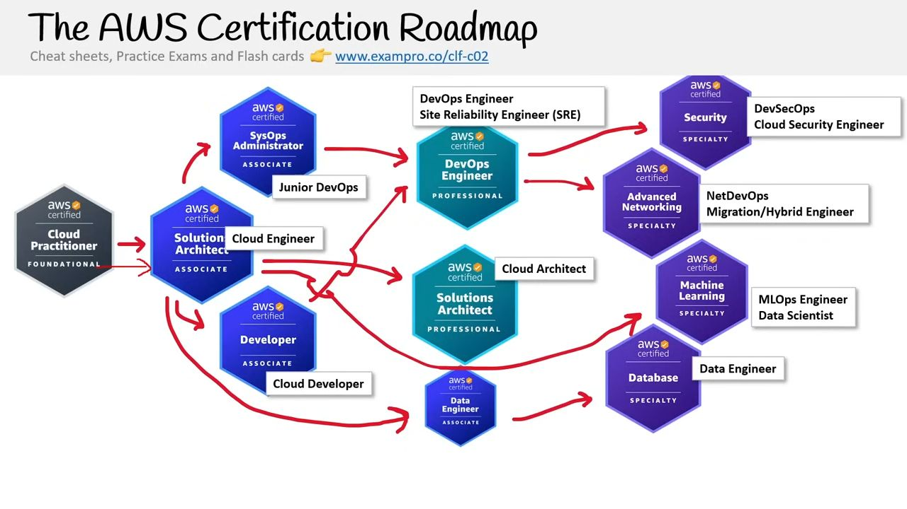

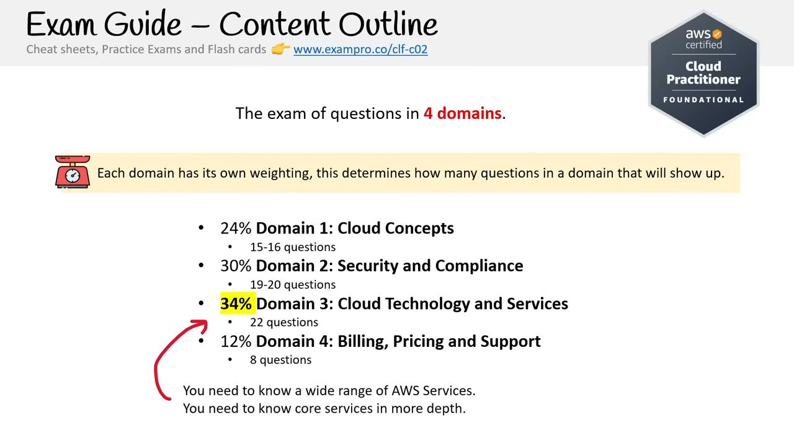

## Exam model

- 65 Questions
    - 50 Questions scored.
    - 15 Questions Unscored.
- 70% cutoff
- 1.5 hours (Exam duration)
- Certificate validation 3 years.

## Free pratice exam - [Click Here](https://www.exampro.co/clf-c02)

## Exam Guide - [Click Here]( https://d1.awsstatic.com/training-and-certification/docs-cloud-practitioner/AWS-Certified-Cloud-Practitioner_Exam-Guide.pdf)

## Cloud Computing 
- cloud computing is the practice of using a network of remote servers hosted on the internet to store manage and process data rather than a local server or personal computer

### On-Premise
- You own the servers
- You hire the IT people
- You pay or rent the real-estate
- you take all the risks

### Cloud Providers
- Someone else owns the servers 
- Someone else hires the IT people 
- Someone else pays or rents the real estate
- You are responsible for configuring cloud services and code, and someone takes care of the rest of it for you

## Evolution of cloud hosting

- **Dedicated Server:** 
    - One physical machine dedicated to single a business.
    - Runs a single web-app/site.
    - Very Expensive, High Maintenance, *High security

    

- **Virtual Private Server (VPS):** 
    - One physical machine dedicated to single a business.
    - The physical machine is virtualized into sub-machines
    - Runs a multiple web-app/site.
    - Better utilization and isolation of Resources.

    

- **Shared Hosting:** 
    - One physical machine shared by hundreds of business.
    - Relies on most tenants under-utilizing their resources.
    - Very cheap, limited functionality, Poor isolation.

    

- **Cloud Hosting:** 
    - Multiple phyiscal machines that acts as a one system.
    - The system is abstracted into multiple cloud services.
    - Flexible, Scalable, Secure, Cost-Effective, High Configurability.

    

## What is a Cloud Service Provider (CSP)?
A Cloud Service Provider (CSP) is a company which
- provides multiple Cloud Services e.g. tens to hundreds of services
- those Cloud Services can be chained together to created cloud architectures
- those Cloud Services are accessible via single unified API eg. AWS API
- those Cloud Services utilized metered billing based on usage e.g. per second, per hour
- those Cloud Services have rich monitoring built in eg. AWS CloudTrail
- those Cloud Services have an infrastructure as a Service (IaaS) offering
- those Cloud Services offers automation via infrastructure as code (IaC)

    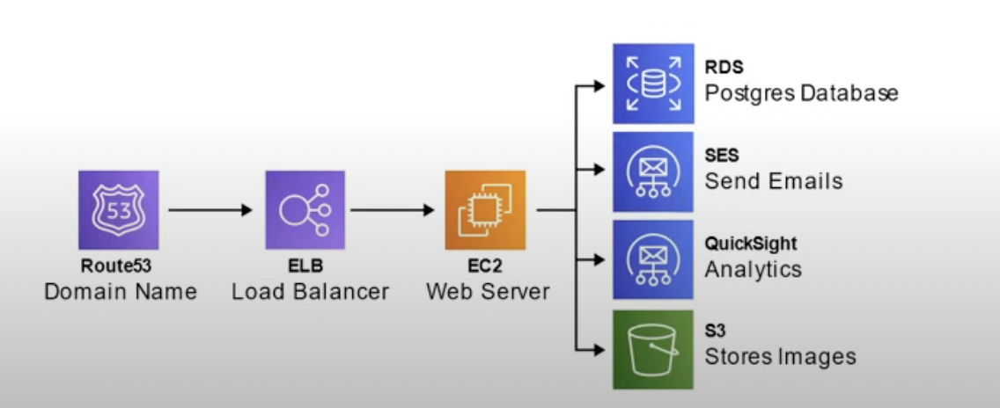

## Landscape of CSPs

- **Tier-1 (Top Tier)** - Early to market, wide offering, strong synergies between services, well recognized in the industry.
    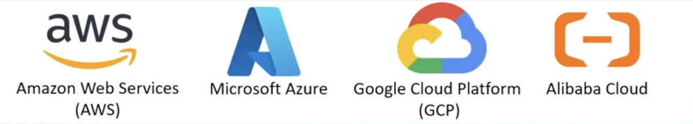

- **Tier-2 (Mid Tier)** - Backed by well known tech companies, slow to innovate and turned to specialization.

    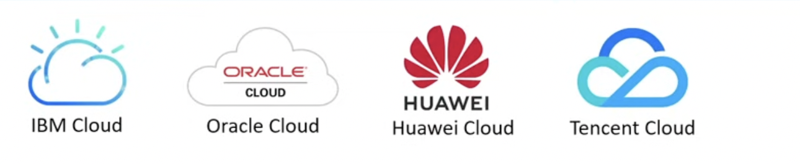

- **Tier-3 (Light Tier)** - Virtual Private Servers (VPS) turned to offer core IaaS offering. Simple, cost-effective.
    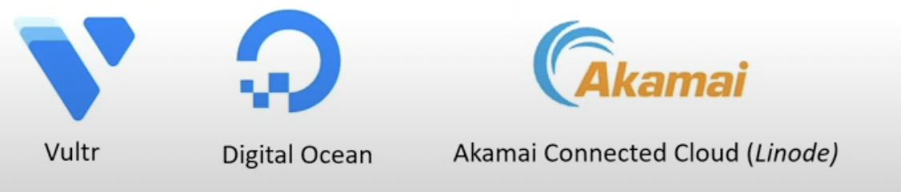

## Common Cloud Services

- A cloud service provider can have 100s of clous services that are grouped into various types of services but the four most common types of cloud services for infrastructures of service would be:

- **Compute:** Imagine having a virtual computer that can run application, programs and code.
- **Networking:** Imagine having a virtual network defining internet connections or network isolations between services or outbound to the internet.
- **Storage:** Imagine having a virtual hard-drive that can store files.
- **Databases:** Imagine having a virtual database for storing reporting data or a databse for genetal purpose web-application.

## The Evolution of Computing

- **Dedicated:** 
    - A physical server wholly utilized by a single customer.
    - You have to guess your capacity.
    - You'll overpay for an underutilized server.
    - You can't vertical scale, you need a manual migration.
    - Replacing a server is very difficult.
    - You are limited by your host OS.
    - Multiple apps can result in conflicts in resource sharing.
    - You have a guarantee of security,privacy, and full utility of 
      underlying resources.
    
    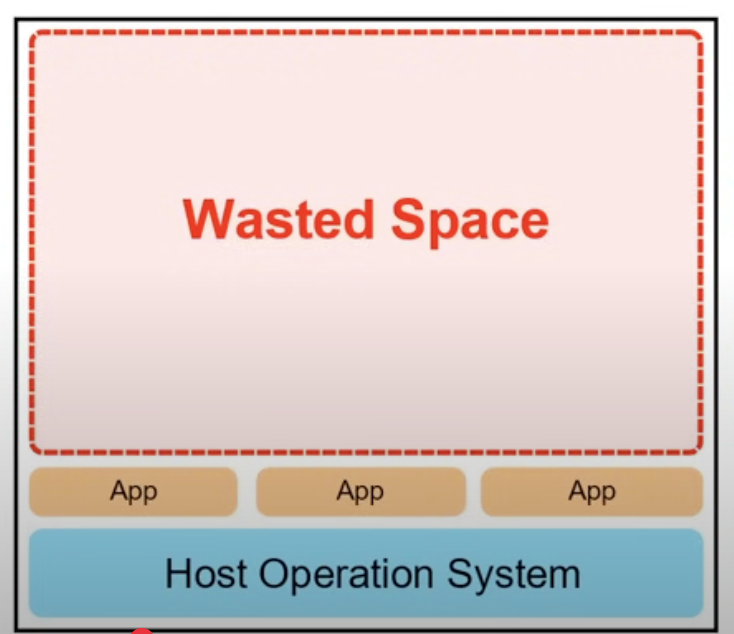

- **Virtual Machines:** 
    - You can run multiple Virtual Machines on one machine.
    - Hypervisor is the software layer that lets you run the virtual machines.
    - A physical server shared by multiple customers.
    - You are to pay for a fraction of the server.
    - You'll overpay for an underutilized Virtual Machine.
    - You are limited by your Guest OS.
    - Multiple apps on a single Virtual Machine can result in conflicts in      resource sharing.
    - Easy to vertical or horizontal scaling.

    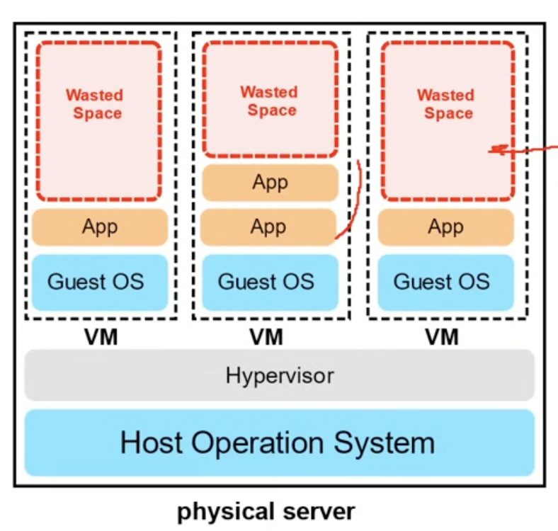

- **Containers:** 
    - Virtual Machine running multiple containers
    - Dcoker Deamon is the name of the software layer that lets you run multiple containers.
    - You can maximize the utilize of the available capacity which is more cost-effective
    - Your containers share the same underlying OS so containers are more efficient than multiple VMs.
    - Multiple apps can run side by side without being limited to the same OS requirements and will not cause conflicts during resource sharing

    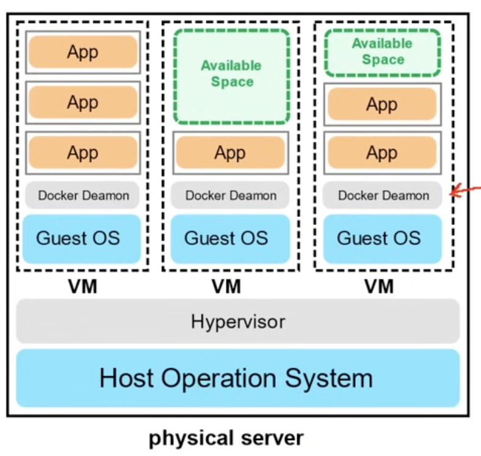

- **Functions:** 
    - Are mamnaged VMs running managed conatiners.
    - Known as Serverless Compute.
    - You upload a piece of code, choose the amount of memory and duration.
    - Only responsible for codr and data, nothing else.
    - Very cost-effective, only pay for the time code is running, VMs only run when there is code to be executed.
    - Cold starts is a side-effect of this setup.

    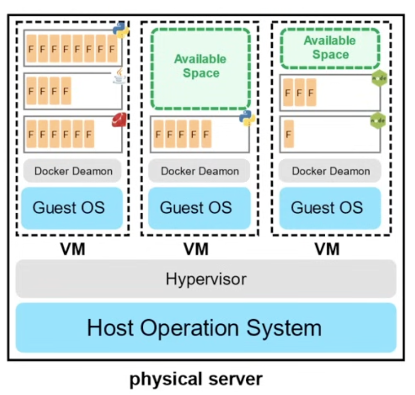

## Type of Cloud Computing

- **SaaS Software as a Service:** (For Customers)
    - A product that is run and managed by the service provider 
    - Don't worry about how the service is  maintained it just works and remains available.
    
    Ex: Salesforce, Gmail.

- **PaaS Platform as a Service:** (For Developers)
    - Focus on the deployment and management of your apps.
    - Don't worry about provisioning, configuring or understanding the hardware or OS.

    Ex: Heroku, Vercel.

- **PaaS Platform as a Service:** (For Developers)
    - Baic building blocks for cloud IT. Provides access to networking features, computers and data storage space.
    - Don't worry about IT staff data centers and hardware.

    Ex: AWS, Azure.

## Cloud Computing Deployment Models

- **Public cloud:** 
    - Everything is built in the CSP.
    - Also known as: Cloud first.

- **Private cloud:** 
    - Everything built on company's datacenters
    - Also known as: On-Premise.
    - The cloud could be OpenStack.

- **Hybrid cloud:** 
    - Using both On-Premise and 
    - A Cloud Service Provider.

- **Cross cloud:** 
    - Using Multiple Cloud Providers
    - Aka multi-cloud, "hybrid-cloud"
    - AWS is not cross cloud friendly.

## Create AWS account - [Click Here](https://aws.amazon.com/)

## What is Computing Power?
- The throughput meausred at whihc a computer can complete a computational task.

    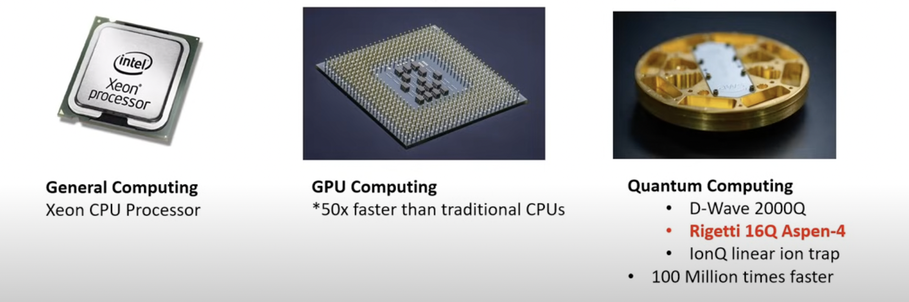

- CPU - EC2
- GPU - AWS Inferentiare
- Quantum computing - AWS Bracket
