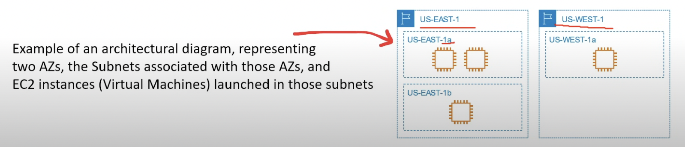

## The benefits of the cloud

- **Agility:**
    -   Increase speed and agility
- **Pay-as-you go pricing:**
    -   Trade capital expense for variable expense
- **Economy of scale:**
    -   Benefit from massive economies of sale
- **Global Reach:**
    -   Go global in minutes
- **Security**
- **Reliability:**
    -   Stop spending money on running and maintaining data centers
- **High Availability**
- **Scalability:**
    -   Benefits from massive economies of scale
- **Elasticity**

## Six Advantages to Cloud

- **Trade capital expense for variable expense:**
    -   You can Pay on-Demand remaning there is no upfront cost and you pay for only what you consume or pay by the hour, minutes or seconds.

        *Instead of paying for upfront costs of data centers and servers*

- **Benefit from massive economies of scale:**
    -  You are sharing the cost with other customers to get unbeatable savings
    
        *100s of thousands of customers utilizing a fraction of a server*

- **Stop guessing capacity:**
    -  Scale up or down to meet the current need. Launch and destory services whenever.

        *Instead of paying for idle or underutilized servers.*

- **Increase speed and agility:**
    -  Launch resources within a few clicks in minutes.

        *Instead of waiting days or weeks of your IT to implement the solution on-premise.*

- **Stop spending money on running and maintaining data centers:**
    -  Focus on your own customers, developing and configuring your applications.

        *Instead of operations such as racking, stacking and powering servers.*

- **Go global in minutes:**
    -  Deploy your app in multiple regions around the world with a few clicks.

        *Provide lower latency and a better experience for your customers at minimal cost*

## AWS Global Infrastructure

- The AWS Global Infrastructure is globally distributed hardware and datacenters that are physically networked together to act as on large resource for the end customer.

The AWS Global Infrastructure is made up of the following resources:

- 32 Launched Regions
- 102 Availability Zones
- 115 Direct Connection Locations
- 550+ Points of Presence
- 35 Local Zone
- 29 Wavelength Zones

## Regions

- Regions are geographically distinct locations consisting of one or more availability zones.
- Every region is physically isolated from and independent of every other region in terms of location, power, water supply

- *AWS 1st region is US-EAST-1 (Northern Virginia), where sqs and s3 launched has happened.*

- Each region generally has three availability Zones
    - Some new users are limited to two eg. US-West
- New services almost always become available first in US-EAST
- Not all AWS Services are available in all regions
- All your billing information appears in US-EAST-1 (North Virginia)
- The cost of AWS services vary per region

When you choose a region there are 4 factors you need to consider:
- What regulatory compliance does this region meet?
- What is the cost of AWS services in this region?
- What AWS services are available in this region?
- What is the distance or latency to my end-users?

## Regional VS Global Services

- **Regional Services:**
    - AWS scopes their AWS Management Console on a selected Region.
    - This will determine where an AWS service will be launched and what will be seen within an AWS Service's console.
    - You generally don't explicitly set the Region for a service at the time of creation.

- **Global Services:**
    - Some AWS Services operate across multiple regions and the region will be fixed to "Global"
    E.g. Amazon S3, CloudFront, Route53, IAM

    - For these global services at the time of creation:
    - There is no concept of region. Eg: IAM user
    - A single region must be explicitly chosen. Eg: S3 Bucket
    - A group of regions are chosen. Eg: CloudFront Distribution

## Availability Zones

- An Availability Zone is physical location made up of one or more datacenter.
- A datacenter is a secured building that conatins hundreds of thousands of computers.
- A region will generally contains 3 Availability Zones.
- Datacenters within a region will be isolated from each other (different buildings). But they will be close enough to provide low-latency(< 10ms).
- Its common practice to run workloads in atleast 3 AZs to ensure services remain available in case one ore two datacenters fail. (High Availability)
- AZz are represented by a Region code, followed by a letter identifier. Eg: us-east-1**a**
- A subnet is associated with an Availability Zone.
- You **never choose the AZ** when launching resoruces.
- You choose the subnet which is associated to the AZ.

## Regions and Availability Zones Visualization
- A region has multiple Azs.
- An Azs is made up of one or more datacenters.
- All AZs in a AWS region are interconnected with high-bandwidth, low-latency networking, over fully redundant, dedicated metro fiber providing high-throughput, low-latency networking between .
- All traffics between AZs are encrypted
- AZz are within 100km (60 miles) of each other.

## AWS Global Network
- The AWS Global Network represent the interconnections between AWS Global Infrastruture. Commonly referred to as the *"The Backbone of AWS"*.

## Points of Presence (PoP)
- This is an intermediate location between an AWS region and the end user, and this location could be a datacenter or collection of hardware.

- For AWS a point if presence is a data center owned by AWS or a trusted partner that is utilized by AWS Services related for content delivery or expediated upload.

**PoP resources are**:
- **Edge Locations**: These are datacenters that hold cached (copy) on the most popular files (eg. web pages, images and videos) so that the delivery of distance to the end users are reduce
- **Regioanl Edge Caches**: These are datacenters that hold much larger caches of less-popular files to reduce a full round trip and also to reduce the cost of transfer fees.

## AWS Services that uses PoP

- **Amazon CloudFront:** It is a content delivery network (CDN) service that:
    - You point your website to CloudFront so that it will route requests to nearest Edge Location cache.
    - Allows you to choose an origin (such as a web-server or storage) that will be source of cached.
    - Caches the contents of what origin would returned to various Edge locations around the world.

- **Amazon S3 transer Acceleration:** It allows you to generate a special URL that can be used by end users to upload files to a nearby Edge location. Once a file is uploaded to an Edge Location, it can move much faster within the AWs network to reach S3.

- **AWS Global Accelerator:** It helps in finding the optimal path from the end user to your web-servers. Global accelerator are deployed within edge locations so you send user traffic to an edge location instead of directly to your web-application.

## AWS Direct Connect

- AWS Direct Connect is private/dedicated connection between your datacenter, office, co-location and AWS.

- Direct Connect has two very-fast network connection options:
    - Lower Bandwidth 50MBps-500MBps
    - Higher Bandwidth 1GBps or 10 GBps

- Helps reduce network costs and increase bandwidth throughput. (great for high traffic)
- Provides a more consistent network experience than a typical interned based connection.

## Local Zones
- Local Zones are datacenters located very close to a densely populated area to single digit milisecond low latency performance for that area.

- The purpose of Local Zone is the support highly-demanding applications
sensitive to latencies:
    - Media & Entertainment
    - Electronic Design Automation
    - Ad-Tech
    - Machine Learning

## Wavelength Zones
- AWS Wavelength Zones allows for edge-computing on 5G networks.
- Application will have ultra-low latency being as close as possible to the users. 
- AWS has partnered with various Telecom companies to utilize their 5G networks.
- Eg: Verizon,KDDI, vodafone.

## Data Residency
- The physical or geographic location of where an organization or cloud resources reside.

## AWS for Government

- **What is Public Sector?**
- Public sectors include public goods and governmental services such as:
- military, law enforcement, infrastructure, public transit, public education, health care, the government itself.

- AWS can be utilized by public sector or organinations developing cloud workloads for the public sector.
- AWS achieves this by meeting regulatory compliance programs along with specific governance and security controls
- AWS has special regions for US regulatiopn called GovCloud.

## AWS in China
- AWs China is the AWS cloud offerings in Mainland China.
- AWS China is completely isolate intentionally from AWS Global to meet regulatory compliance for Mainland China.
- AWS China is on its own domain at: [amazonaws.cn](https://amazonaws.cn)
- Inorder to operate in AWS China Region you need have a Chinese Business License (ICP license). Not all services are available in china eg. Route53

## Sustainability
- AWS Cloud's Sustainability goals are composed of three parts:
- **Renewable Energy:** AWS is working towards having their AWS Global Infrastructure powered by 100% renewable energy by 2025.
- **Cloud Efficiency:** AWS infrastructure is 3.6 times more energy efficient than the median of U.S. enterprise data centers surveyed.
- **Water Stewardship:** Dorect evaporatuve technology to cool our data center. Use of non-potable water for cooling puporses(recycled water).

## AWS Ground Station
- It is a fully managed service that lets you control satellite communications, process data, and scale your operations without having to worry about building or managing your own station infrastructure.

- Use cases for Ground Station:
    - Weather forecasting
    - Surface imaging
    - communications
    - video broadcasts

- To Ground Station:
    - You schedule a Contact(select staellite, start and end time, and the ground location)
    - Use the AWS Ground Station EC2 AMI to launch EC2 instances that will uplink and downlink data during the contact or recieve downlinked data in an Amazon S3 bucket.

- Use Case:
A company reached an agreement with a Satellite Imagery Provider to take satellite photos of a specific region. They use AWS Ground Station to communicate that company's Satellite and download the S3 image data.

## AWS Outposts
- It is a fully managed service that offers the same AWS infrastructure, AWS services, APIs and tools to virtually any datacenter, co-location soace, or on-premises facility for a truly consistent hybrid experience.
- AWS outposts is rack of servers running AWS infrastructure on your physical location.

- What is a server rack?
    - A frame design to hold and organise IT equipment.
- Rack Heights
    - U stands for "rack units" or "U spaces" with is equal to 1.75 inches. The industry standard rack siz is 48U (7 foot Rack)

    

- AWS outposts comes in 3 form factors: 42U, 1U and 2U

## Cloud Architecture Terminologies

- **What is a Solution Architect?**
- A role in a technical organization that Architects a technical solution using multiple systems via researching documentation and experimentation.

- **What is a Cloud Architect?**
- A solutions architect that is focused solely on architecting Technical Solutions using cloud services.

- **Factors to design architecture**
    - **Availability:** Your ability to ensure a service remains available eg. Highly Available
    - **Scalability:** Your ability to grow rapidly or unimpeded
    - **Elasticity:** Your ability to shrink and grow to meet the demand.
    - **Fault tolerance:** Your ability to prevent a failure
    - **Disaster Recovery:** Your ability to recover from a failure eg. Highly Durable.

## High Availability
- Your ability for your service to remain available by ensuring there is no single point of failure and/or ensure a certain level of performance.
- Running your workload across multiple Availability Zones ensures that if 1 or 2 AZs become unavailable your service / application remains available.
    
- This can be achieved by Elastic Load Balancer.

## High Scalability
- Your ability to increase your caapcity based on the increasing demand of traffic, memory and computing power

- **Vertical Scaling:** Upgrade to a bigger server
- **Horizontal Scaling:** Add more servers of the same size

    

## High Elasticity
- Your ability to automatically increase or decrease your capacity based on the current demand of traffic, memory and computing power
- **Scaling Out:** Add more servers of the same size.
- **Scaling In:** Removing underutilized servers of the same size.
- Vertical sacling is generally hard for traditional architecture so you'll usually only see horizontal scaling described with Elasticity
- This can be achieved by Auto Scaling Groups.

## Highly Fault Tolerant
- your ability for your service to ensure there is no single point of failure. Preventing the chance of failure.
- Fail-overs is when you have a plan to shift traffic to a redundant system in case the primary system fails.
- very common example is having a copy or secondary database where all ongoing changes are synced the secondary system is not in use until a fail over occurs and it becomes the primary database.

    

## Highly Durability
- your ability to recover from a disaster and to prevent the loss of data.
- solutions that recover from a disaster is known as **Disaster Recovery(DR)**
- Do you have a backup?
- How fast can you restore the backup?
- Does your backup still work?
- How do you ensure current live data is not corrupt?

- **CloudEndure Disaster Recovery:** Cloud endurer which is a disaster recovery service which continuously replicates your machines in a lowcost staging area in your target AWS account and preferred region enabling fast and reliable recovery in the case of an IT data center fails.

##  Business Continuity Plan
- It is a document that outlines how a business will continue operating during an unplanned disruption in services.

- **Recovery Point Objective (RPO):** The maximum acceptable amount of data loss after an unplanned data loss incident, expressed as an amount of time.

- **Recovery Time Objective:** the maximum amount of downtime your business can tolerate without inuring a significant financial loss.

    

